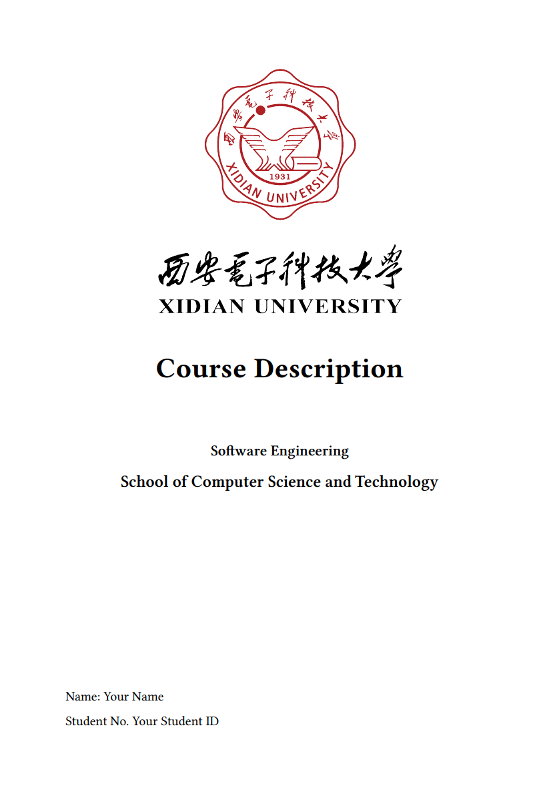
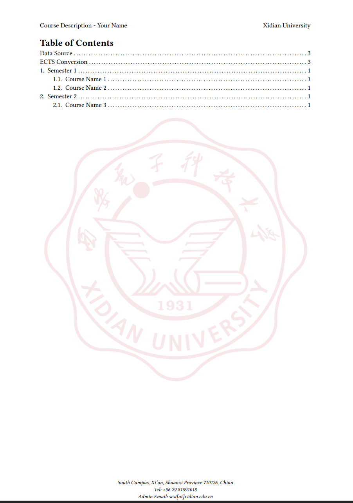
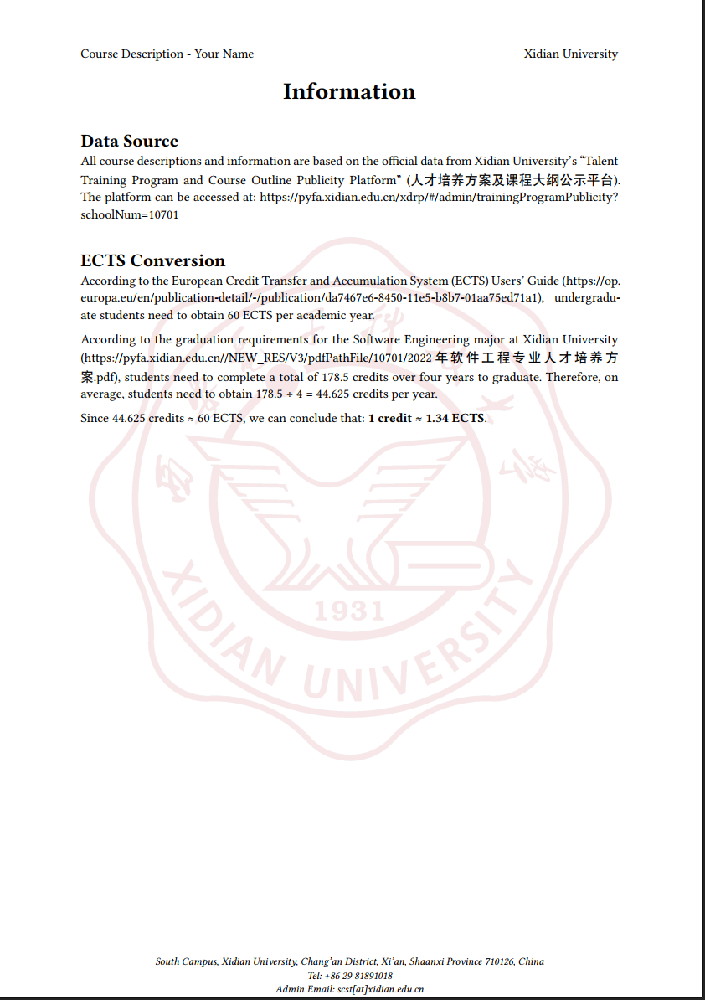
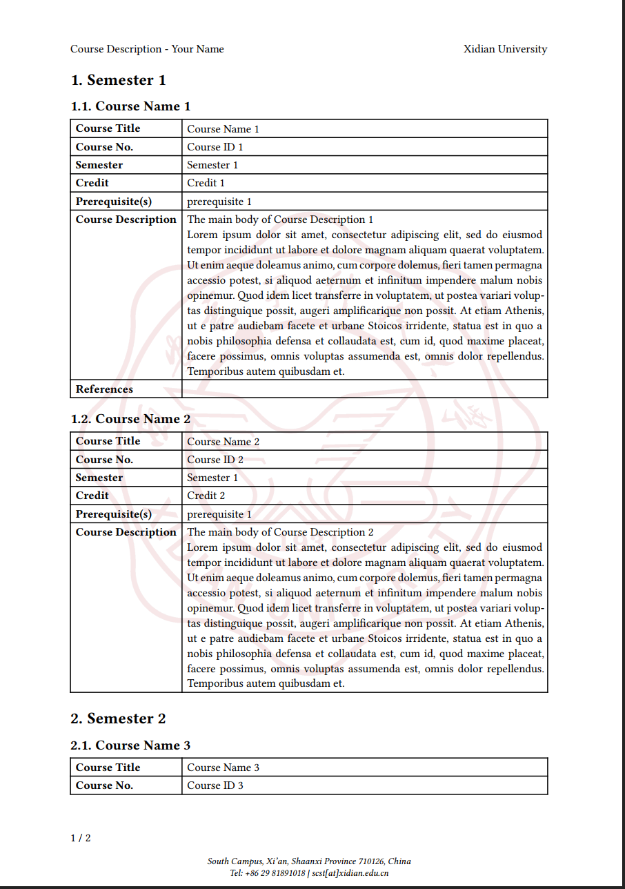

# XDU Course Description Template

This repository contains a template for creating Course Description using [Typst](https://typst.app/). It is designed to assist students at Xidian University (XDU) in generating clear and professional course summaries in a standardized and visually appealing format, especially useful when applying to universities abroad.

## Acknowledgments

This template is a fork and adaptation of the original [BUPT Course Description Template](https://github.com/dsyislearning/typst-course-description-template.git) by [dsyislearning](https://github.com/dsyislearning). The original template was designed for BUPT students, and this version has been customized for Xidian University (XDU) students.

## Installation

If you haven't installed Typst yet, you can install it using Homebrew:

```bash
brew install typst
```

For other installation methods, please refer to the [official Typst documentation](https://github.com/typst/typst?tab=readme-ov-file#installation).

## Usage

### Running the Template

To generate a PDF file, use the following command:

```bash
typst watch main.typ example.pdf
```

The `watch` mode will automatically recompile the PDF whenever you make changes to `main.typ` or `template.typ` files. If you only want to compile once without watching, you can use:

```bash
typst compile main.typ example.pdf
```

### Configuration

In the `main.typ` file, you need to fill in your personal information and course details. The template will automatically generate a PDF file with the course descriptions.

#### Metadata

Begin your `main.typ` file with the following metadata:

```typst
#import "template.typ": template, course

#show: template.with(
  university: "Xidian University",
  major: "Software Engineering",
  school: "School of Computer Science and Technology",
  name: "Your Name",
  id: "Your Student ID",
  // The cover image settings
  cover: (
    logo_path: "XDU_Logo/logo_xdu_badge_with_name2.png",
    logo_width: 60%,
    logo_with_university_name: true,
  ),
  // The watermark image settings as the background of the document
  watermark: (
    img_path: "XDU_Logo/logo_xdu_badge_translucent.png",
    img_width: 160mm,
  ),
)
```

#### Course Organization by Semester

Courses are organized by semester. Use `= Semester X` to create a new semester section:

```typst
= Semester 1

#course(
  name: [Course Name 1],
  id: [Course ID 1],
  semester: [Semester 1],
  credit: [Credit 1],
  hours: [Hours 1],
  grade: [Grade 1],
  prerequisite: [Prerequisite Course(s)],
  description: [
    The main body of Course Description 1 \
    Your detailed course description here.
  ],
  references: [
    - Reference Book 1
    - Reference Book 2
  ],
)

= Semester 2

#course(
  name: [Course Name 2],
  id: [Course ID 2],
  semester: [Semester 2],
  credit: [Credit 2],
  hours: [Hours 2],
  grade: [Grade 2],
  description: [
    The main body of Course Description 2 \
    Your detailed course description here.
  ],
)
```

#### Course Description Parameters

The `#course` function supports the following parameters (all optional):

- `name`: Course name
- `id`: Course ID
- `semester`: Semester when the course was taken
- `credit`: Credit hours
- `hours`: Total course hours
- `grade`: Your grade in the course
- `preparatory`: Preparatory courses
- `prerequisite`: Prerequisite courses
- `content`: Course content (list format)
- `description`: Course description (main text)
- `assessment`: Assessment methods
- `references`: Reference materials

If you don't provide a parameter, it will not be shown in the course description table.

## Preview

Sample output pages:

|  |  |
| --------------------------------- | --------------------------------- |
|  |  |

## Alternative: Word Template

If you prefer to use Microsoft Word instead of Typst, you can use the Word template located in the `Word Template` directory. The Word file (`Xidian_Course_Description_Template.docx`) provides an alternative way to create your course descriptions with a similar format.

